## 目次
* [ToF AR Pro について](#about)
* [ToF AR Samples Basic Pro の概要](#overview)
* [コンポーネント](#component)
* [アセット](#assets)
* [開発環境](#environment)
* [注意事項](#notes)

# ToF AR Pro について

ToF AR Pro は、Time-of-Flight(ToF)センサを持つiOS/Andoroidスマートフォン向けの、Unity向けツールキットライブラリです。

Structured light 方式など、ToF 以外のDepthセンサでも ToF AR Pro は動作します。

サンプルアプリケーションのビルドと実行には、この ToF AR Pro の他に、UnityとToFセンサを搭載した対応スマートフォンが必要です。

# ToF AR Samples Basic Pro の概要

**ToF AR Samples Basic Pro** は ToF AR Pro の機能を使った簡単なサンプルアプリケーションで、下記のシーンを提供しています。

## サンプルシーン一覧

<table>
<tr align="center">
    <th width="250">Color</th>
    <th width="250">ColorDepth</th>
    <th width="250">BasicStream</th>
    <th width="250">DepthConfidence</th>
</tr>
<tr align="center">
    <td>Colorイメージを表示</td>
    <td>ColorイメージとDepthイメージを重畳表示</td>
    <td>Depth/Confidence/Colorを並べて表示</td>
    <td>DepthイメージとConfidenceイメージを画面2分割で表示</td>
</tr>
<tr align="center">
    <td>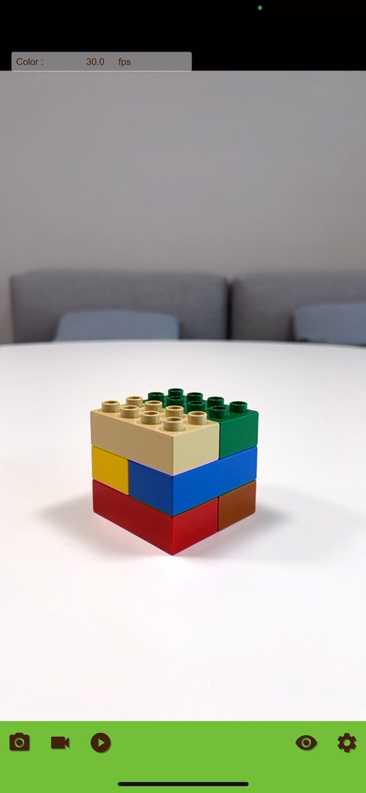</td>
    <td>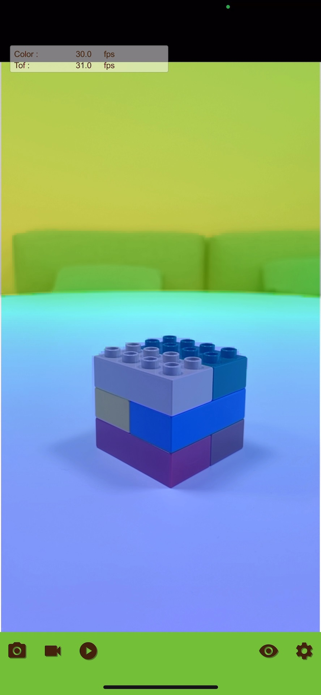</td>
    <td>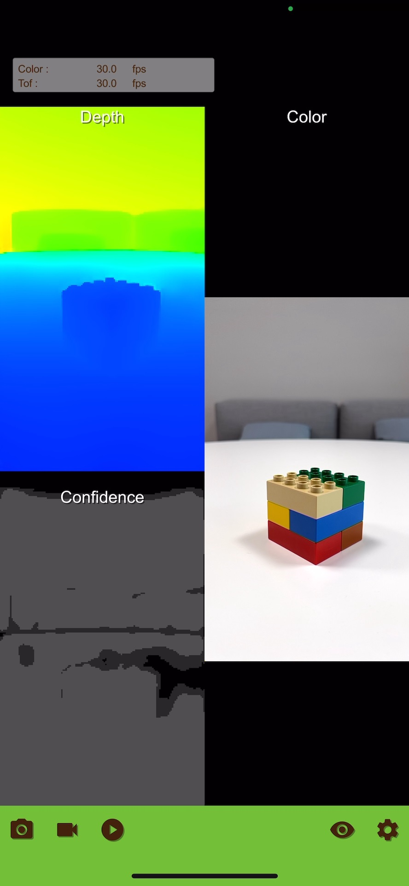</td>
    <td>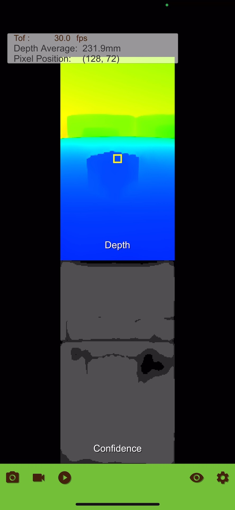</td>
</tr>
</table>

<table>
<tr align="center">
    <th width="250">PointCloud</th>
    <th width="250">ColoredPointCloud</th>
    <th width="250">HumanPointCloud</th>
    <th width="250">Segmentation</th>
</tr>
<tr align="center">
    <td>PointCloudを3次元空間に表示</td>
    <td>PointCloudを3次元空間にColor表示</td>
    <td>人物部分のPointCloudを3次元空間にColor表示</td>
    <td>人物、空のセグメンテーション結果をマスクとして表示</td>
</tr>
<tr align="center">
    <td>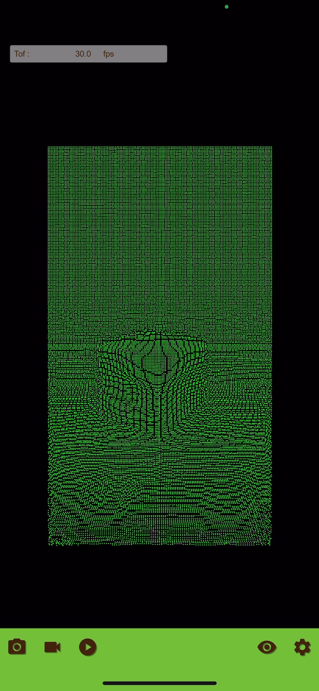</td>
    <td>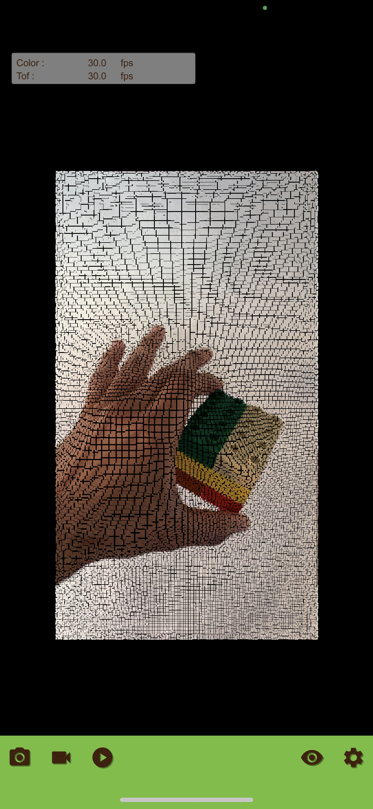</td>
    <td>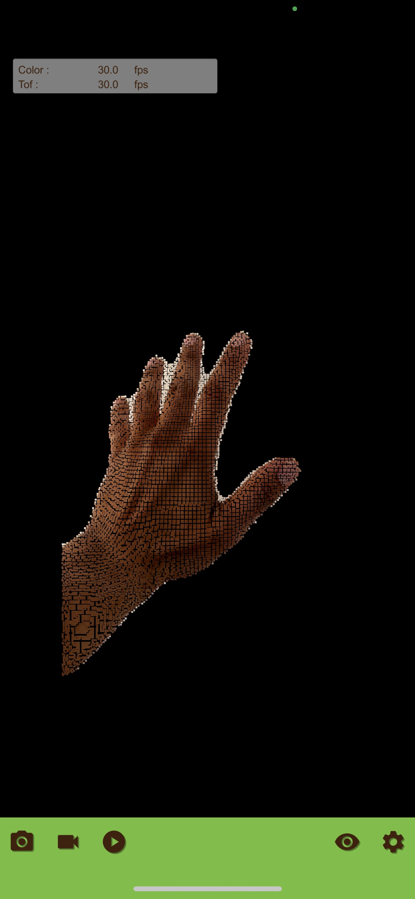</td>
    <td>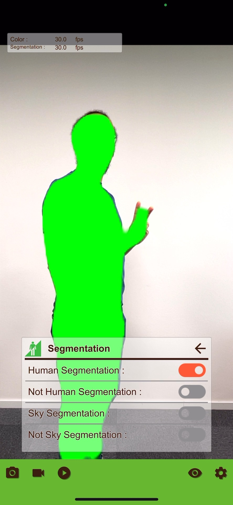</td>
</tr>
</table>

<table>
<tr align="center">
    <th width="250">Hand</th>
    <th width="250">LiveMeshOcclusion</th>
    <th width="250">ColorHandOcclusion</th>
    <th width="250">Body</th>
</tr>
<tr align="center">
    <td>手のボーンモデルを表示</td>
    <td>被写体のDepthに基づき、仮想キューブをオクルージョン表示</td>
    <td>手のDepthに基づき、仮想キューブをオクルージョン表示。あわせて手のボーンモデルを表示</td>
    <td>人体のボーンモデルを、Depthイメージの上に表示</td>
</tr>
<tr align="center">
    <td>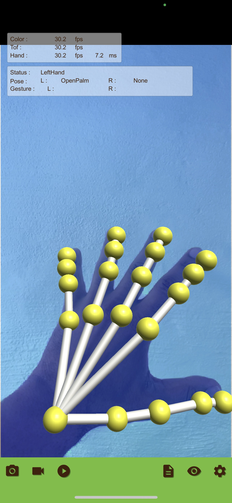</td>
    <td>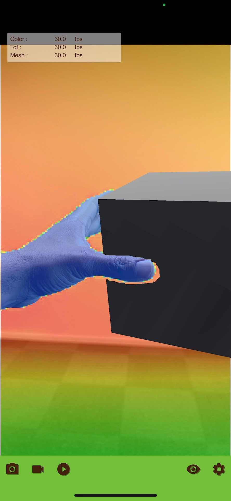</td>
    <td>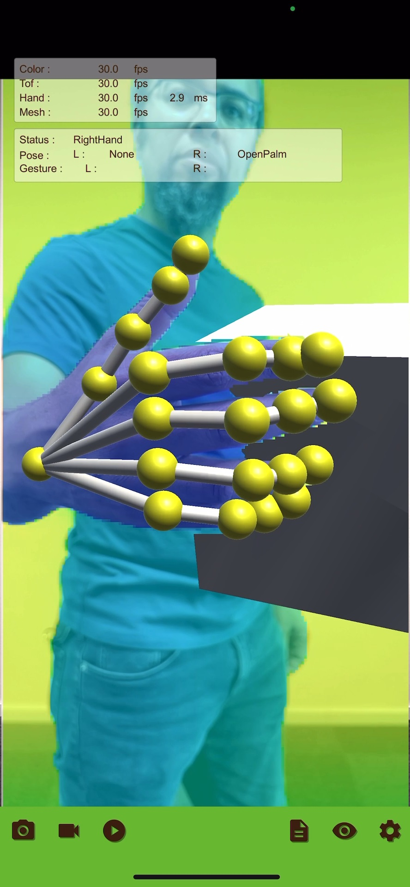</td>
    <td>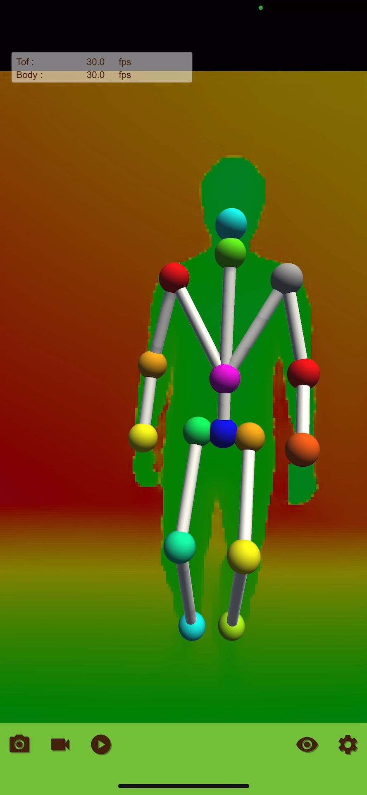</td>

</tr>
</table>

<table>
<tr align="center">
    <th width="250">ColorBody</th>
    <th width="250">HandMark</th>
    <th width="250">ColorHandMark</th>
    <th width="250">SLAM</th>
</tr>
<tr align="center">
    <td>人体のボーンモデルを、DepthイメージとColorイメージを重畳した画像の上に表示</td>
    <td>人差し指で描いたマークを認識し、マーク名を表示</td>
    <td>人差し指で描いたマークを認識し、マーク名を表示。あわせてDepthイメージにColorイメージを重畳表示</td>
    <td>SLAMに対応したカメラ座標表示</td>
</tr>
<tr align="center">
    <td>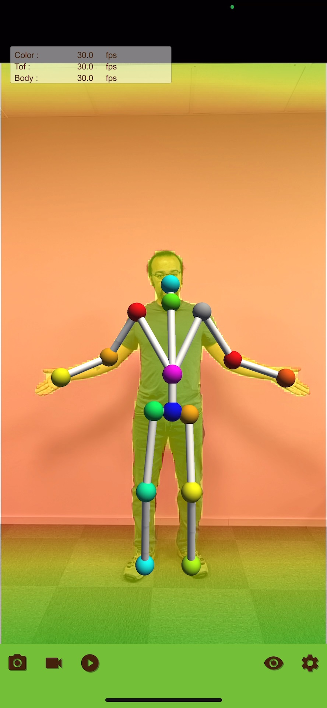</td>
    <td>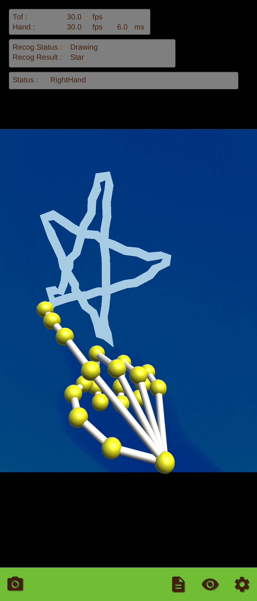</td>
    <td>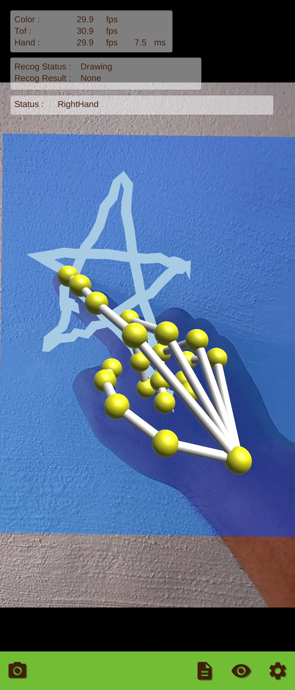</td>
    <td>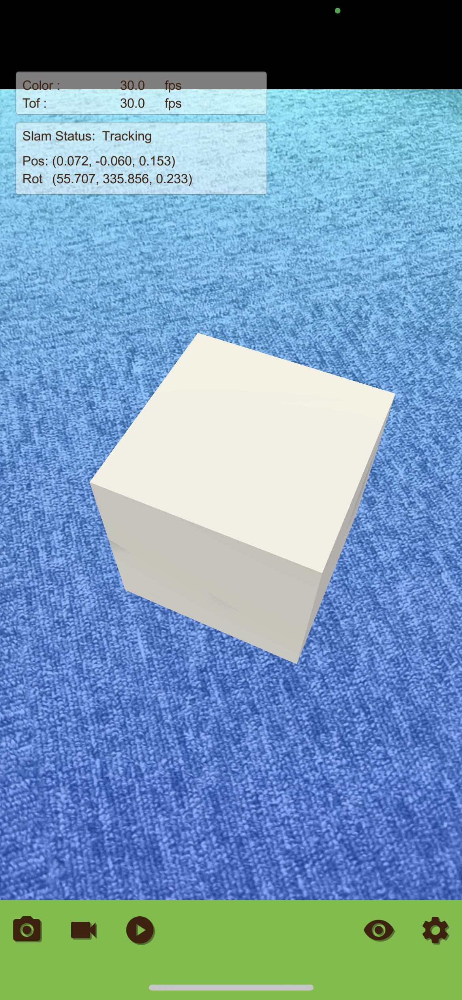</td>
</tr>
</table>

<table>
<tr align="center">
    <th width="250">Face</th>
    <th width="250">Plane</th>
    <th width="250">Recorder</th>
    <th width="250">Humanoid</th>
</tr>
<tr align="center">
    <td>顔認識に基づき顔の上に白色マスクを表示。あわせて口の形からあいうえお認識結果を表示</td>
    <td>認識した平面と垂直方向を表示</td>
    <td>選択したコンポーネントの出力データを画像、CSVファイルに保存</td>
    <td>認識情報より算出された自然なリグ制御を行い、ヒューマノイドタイプのモデル動作を表示</td>
</tr>
<tr align="center">
    <td>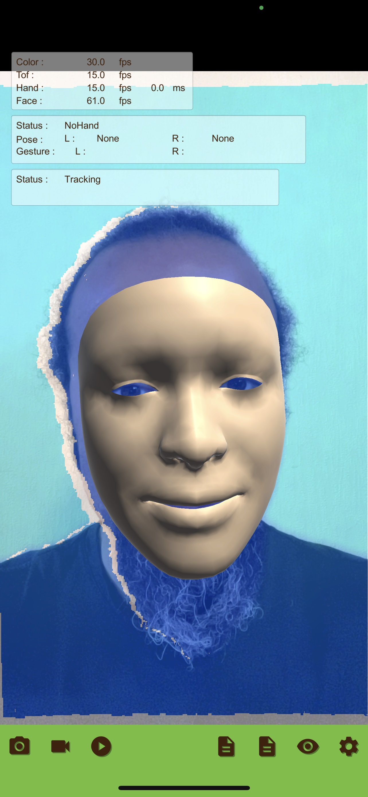</td>
    <td>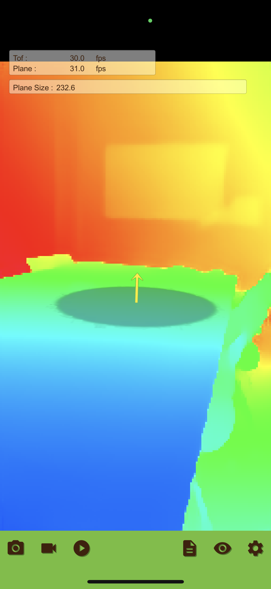</td>
    <td>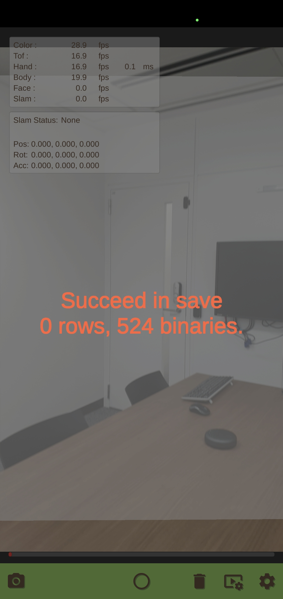</td>
    <td>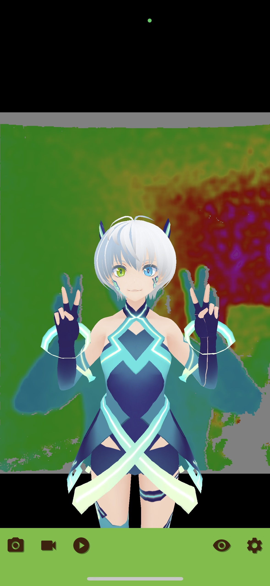</td>
</tr>
</table>

## 操作手順

ビルドしたアプリケーションの操作手順です。

1. アプリケーションを起動し、トップ画面のシーン一覧からシーンを選んでタップします。 

    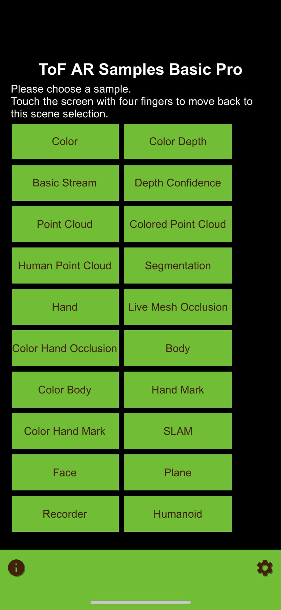

1. 画面左下のカメラアイコンをタップすると、選択したシーンで有効なカメラのリストが表示されます。カメラを選択すると、シーンの動作を開始します。　 

1. シーンからトップ画面に戻るには、4本の指で画面をタップします。

# コンポーネント

サンプルアプリケーションのシーンと、各シーンが利用する ToF AR Pro コンポーネントの関係を示すテーブルです。縦にシーン名、横にコンポーネント名を並べています。チェックマークは、コンポーネント利用を示します。

||ToF|Color|Mesh|Coordinate|Hand|MarkRecog|Body|Segmentation|Slam|Face|Plane|Modeling|Humanoid|
|:--|:-:|:-:|:-:|:-:|:-:|:-:|:-:|:-:|:-:|:-:|:-:|:-:|:-:|
|Color             |  |✓|  |  |  |  |  |  |  |  |  |  |  |
|ColorDepth        |✓|✓|  |✓|  |  |  |  |  |  |  |  |  |
|BasicStream       |✓|✓|  |  |  |  |  |  |  |  |  |  |  |
|DepthConfidence   |✓|  |  |  |  |  |  |  |  |  |  |  |  |
|PointCloud        |✓|  |  |  |  |  |  |  |  |  |  |  |  |
|ColorPointCloud   |✓|✓|  |✓|  |  |  |  |  |  |  |  |  |
|HumanPointCloud   |✓|✓|  |✓|  |  |  |✓|  |  |  |  |  |
|Segmentation      |  |✓|  |  |  |  |  |✓|  |  |  |  |  |
|Hand              |✓|✓|  |✓|✓|  |  |  |  |  |  |  |  |
|LiveMeshOcclusion |✓|✓|✓|✓|  |  |  |  |  |  |  |  |  |
|ColorHandOcclusion|✓|✓|✓|✓|✓|  |  |  |  |  |  |  |  |
|Body              |✓|  |  |  |  |  |✓|  |  |  |  |  |  |
|ColorBody         |✓|✓|  |✓|  |  |✓|  |  |  |  |  |  |
|HandHark          |✓|  |  |  |✓|✓|  |  |  |  |  |  |  |
|ColorHandMark     |✓|✓|  |  |✓|✓|  |  |  |  |  |  |  |
|SLAM              |✓|✓|  |  |  |  |  |  |✓|  |  |  |  |
|Face              |✓|✓|  |✓|✓|  |  |  |  |✓|  |  |  |
|Plane             |✓|  |  |  |  |  |  |  |  |  |✓|  |  |
|Recorder          |✓|✓|  |  |✓|  |✓|  |✓|✓|  |  |  |
|Humanoid          |✓|  |  |  |✓|  |✓|  |  |✓|  |  |✓|

# アセット

**ToF AR Samples Basic Pro**は、以下のアセットを提供します。アセットには、URP（Universal Render Pipeline）と、3DキャラクターやアバターのためのVRMも含まれます。

### TofArSamplesBasicPro
サンプルシーンのスクリプトやリソースが、コンポーネントごとに格納されています。

### TofArSettings
各コンポーネントが使用する設定変更UIとして、プレハブやスクリプトが格納されています。

|File|Description|
|:--|:--|
|Settings.Prefab|設定操作用UI|
|XXXController.Prefab|各コンポーネントの設定変更を管理|

### URP（Universal Render Pipeline）

シーンのコンテンツを画面に表示するための、Unity標準の軽量なレンダリングパイプラインです。アセットに含まれています。

詳細は[Universal Render Pipeline ドキュメント](https://docs.unity3d.com/Packages/com.unity.render-pipelines.universal@7.1/manual/index.html)を参照して下さい。

### VRM
人型のキャラクター・アバターを取り扱う、プラットフォーム非依存の3Dアバターファイルフォーマットです。アセットに含まれています。

詳細は[VRM ドキュメント](https://vrm.dev/en/vrm/vrm_about/)を参照して下さい。

# 開発環境

## ビルド用ライブラリ
ビルドには、ToF AR Pro が必要です。ToF AR Pro をインポートして使用して下さい。  
インポート前にプロジェクトを開くと、設定によってはセーフモードへの移行確認メッセージが表示されます。  
セーフモードに移行した場合、セーフモードメニューなどからセーフモードを終了してインポートを行って下さい。

## 動作検証環境

動作検証は、下記の環境で行っています。

* Unity Version : 2021.3.31f1
* ToF AR Pro Version : 1.4.0

# 注意事項

認識可能なハンドジェスチャーは国・地域によって異なる意味を有する場合があります。  
事前に確認されることをお勧めします。

